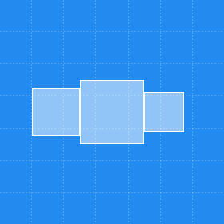
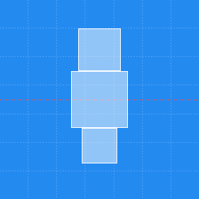

# KGNAutoLayout

`KGNAutoLayout` makes `AutoLayout` easy!

[]()
[]()
[]()
[](/releases)
[](/LICENSE)

[](https://travis-ci.org/kgn/KGNAutoLayout)
[](https://github.com/Carthage/Carthage)
[](https://cocoapods.org/pods/KGNAutoLayout)
[](https://cocoapods.org/pods/KGNAutoLayout)

[](http://twitter.com/iamkgn)
[](https://github.com/kgn)
[](https://github.com/kgn/KGNAutoLayout)

## Installing

### Carthage
```
github "kgn/KGNAutoLayout"
```

### CocoaPods
```
pod 'KGNAutoLayout'
```

## Examples

### Example App


### Pin: Superview

``` Swift
view.pinToEdgesOfSuperview(offset: 20)
```

--


``` Swift
view.pinToTopEdgeOfSuperview(offset: 20)
```

--


``` Swift
view.pinToRightEdgeOfSuperview(offset: 20)
```

--


``` Swift
view.pinToBottomEdgeOfSuperview(offset: 20)
```

--


``` Swift
view.pinToLeftEdgeOfSuperview(offset: 20)
```

--


``` Swift
view.pinToSideEdgesOfSuperview(offset: 20)
```

--


``` Swift
view.pinToTopAndBottomEdgesOfSuperview(offset: 20)
```

--

### Pin: Edges

``` Swift
view.pinTopEdgeToTopEdgeOfItem(itemView, offset: 20)
```

--


``` Swift
view.pinRightEdgeToRightEdgeOfItem(itemView, offset: 20)
```

--


``` Swift
view.pinBottomEdgeToBottomEdgeOfItem(itemView, offset: 20)
```

--


``` Swift
view.pinLeftEdgeToLeftEdgeOfItem(itemView, offset: 20)
```

--

### Center

``` Swift
view.centerInSuperview()
```

--


``` Swift
view.centerHorizontallyInSuperview()
```

--


``` Swift
view.centerVerticallyInSuperview()
```

--


``` Swift
parentView.centerViewsHorizontally([view1, view2, view3])
```

--


``` Swift
parentView.centerViewsVertically([view1, view2, view3])
```

--


``` Swift
view.centerHorizontallyToItem(itemView)
```

--


``` Swift
view.centerVerticallyToItem(itemView)
```

--

### Size

``` Swift
view.sizeToWidth(80)
```

--


``` Swift
view.sizeToHeight(80)
```

--


``` Swift
view.sizeToWidthAndHeight(80)
```

--


``` Swift
view.sizeWidthToWidthOfItem(itemView)
```

--


``` Swift
view.sizeHeightToHeightOfItem(itemView)
```

--


``` Swift
view.sizeHeightToWidthOfItem(itemView)
```

--


``` Swift
view.sizeWidthToHeightOfItem(itemView)
```

--


``` Swift
view.sizeWidthAndHeightToWidthAndHeightOfItem(itemView)
```

--


``` Swift
view.sizeHeightToWidthAspectRatio(16/9)
```

--


``` Swift
view.sizeWidthToHeightAspectRatio(16/9)
```

--

### Position

``` Swift
view.positionAboveItem(itemView, offset: 20)
```

--


``` Swift
view.positionToTheRightOfItem(itemView, offset: 20)
```

--


``` Swift
view.positionBelowItem(itemView, offset: 20)
```

--


``` Swift
view.positionToTheLeftOfItem(itemView, offset: 20)
```

--


``` Swift
itemView.positionViewsAbove([view1, view2, view3], offset: 20)
```

--


``` Swift
itemView.positionViewsToTheRight([view1, view2, view3], offset: 20)
```

--


``` Swift
itemView.positionViewsBelow([view1, view2, view3], offset: 20)
```

--


``` Swift
itemView.positionViewsToTheLeft([view1, view2, view3], offset: 20)
```

--

### Between

``` Swift
view.fitBetween(topView, bottomItem: bottomView, offset: 20)
```

--


``` Swift
view.fitBetween(leftView, rightItem: rightView, offset: 20)
```

--

### Fill

``` Swift
parentView.fillHorizontally([view1, view2, view3], separation: 20)
```

--


``` Swift
parentView.fillVertically([view1, view2, view3], separation: 20)
```

--

### Bound

``` Swift
itemView.boundHorizontally([view1, view2, view3], separation: 20)
```

--


``` Swift
itemView.boundVertically([view1, view2, view3], separation: 20)
```


## Progress:
- [X] Travis
- [X] Badges
- [X] Tests
- [X] Carthage
- [X] CocoaPods
- [X] Description
- [X] Documentation
- [X] Example App
