# KGNAutoLayout

`KGNAutoLayout` makes `AutoLayout` easy!

[]()
[](/releases)
[](/LICENSE)

[](https://travis-ci.org/kgn/KGNAutoLayout)
[]()
[](https://github.com/Carthage/Carthage)
[](https://cocoapods.org/pods/KGNAutoLayout)
[](https://cocoapods.org/pods/KGNAutoLayout)

[](http://twitter.com/iamkgn)
[](https://github.com/kgn)
[](https://github.com/kgn/KGNAutoLayout)

## Installing

### Carthage
```
github "kgn/KGNAutoLayout"
```

### CocoaPods
```
pod 'KGNAutoLayout'
```

## Examples

### Example App


### Pin: Superview

``` Swift
view.pinToEdgesOfSuperview(withOffset: 20)
```
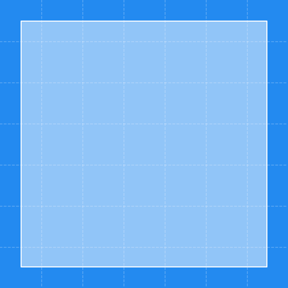
--


``` Swift
view.pinToTopEdgeOfSuperview(withOffset: 20)
```
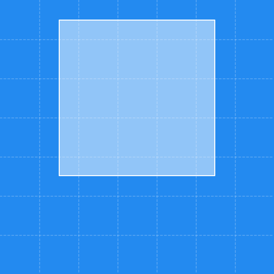
--


``` Swift
view.pinToRightEdgeOfSuperview(withOffset: 20)
```
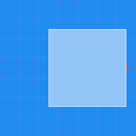
--


``` Swift
view.pinToBottomEdgeOfSuperview(withOffset: 20)
```
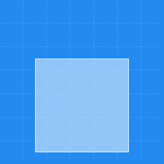
--


``` Swift
view.pinToLeftEdgeOfSuperview(withOffset: 20)
```
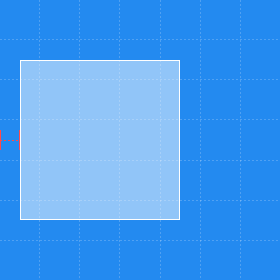
--


``` Swift
view.pinToSideEdgesOfSuperview(withOffset: 20)
```
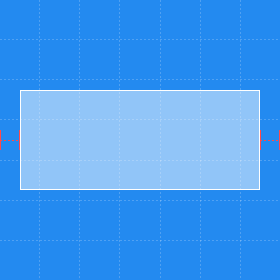
--


``` Swift
view.pinToTopAndBottomEdgesOfSuperview(withOffset: 20)
```
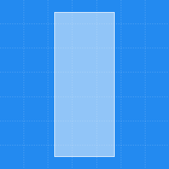
--

### Pin: Edges

``` Swift
view.pinTopEdgeToTopEdge(of: itemView, withOffset: 20)
```
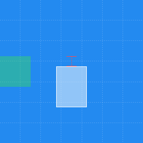
--


``` Swift
view.pinRightEdgeToRightEdge(of: itemView, withOffset: 20)
```
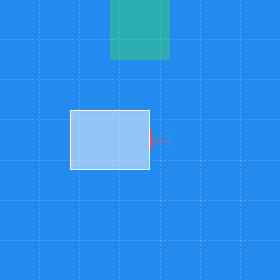
--


``` Swift
view.pinBottomEdgeToBottomEdge(of: itemView, withOffset: 20)
```
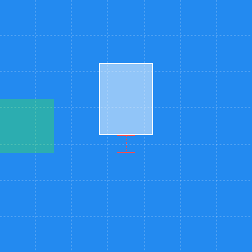
--


``` Swift
view.pinLeftEdgeToLeftEdge(of: itemView, withOffset: 20)
```
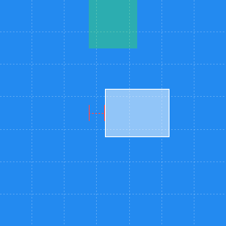
--

### Center

``` Swift
view.centerInSuperview()
```
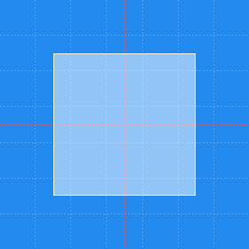
--


``` Swift
view.centerHorizontallyInSuperview()
```
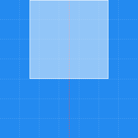
--


``` Swift
view.centerVerticallyInSuperview()
```

--


``` Swift
[view1, view2, view3].centerHorizontally(to: parentView, withSeparation: 20)
```
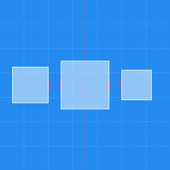
--


``` Swift
[view1, view2, view3].centerVertically(to: parentView, withSeparation: 20)
```
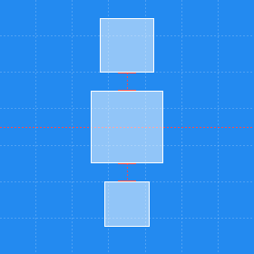
--


``` Swift
view.centerHorizontally(to: itemView)
```
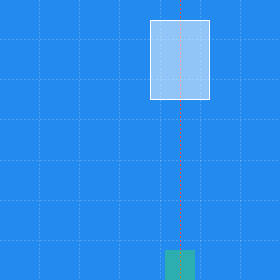
--


``` Swift
view.centerVertically(to: itemView)
```

--

### Size

``` Swift
view.size(toWidth: 80)
```
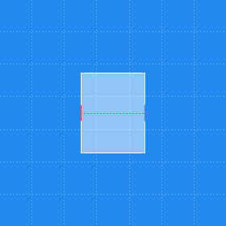
--


``` Swift
view.size(toMinWidth: 40)
```
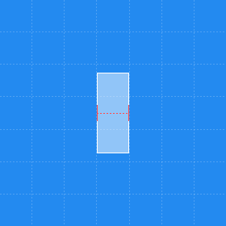
--


``` Swift
view.size(toMaxWidth: 100)
```
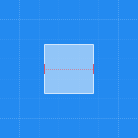
--


``` Swift
view.size(toHeight: 80)
```
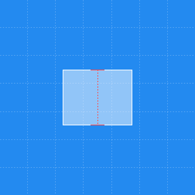
--


``` Swift
view.size(toMinHeight: 40)
```
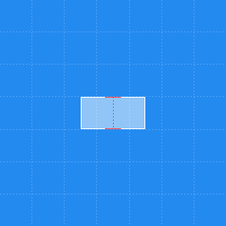
--


``` Swift
view.size(toMaxHeight: 100)
```
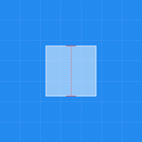
--


``` Swift
view.size(toWidthAndHeight: 80)
```
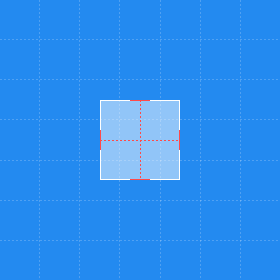
--


``` Swift
view.size(toMinWidthAndHeight: 40)
```
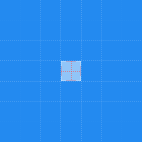
--


``` Swift
view.size(toMaxWidthAndHeight: 100)
```
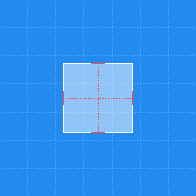
--


``` Swift
view.sizeWidthToWidth(of: itemView)
```
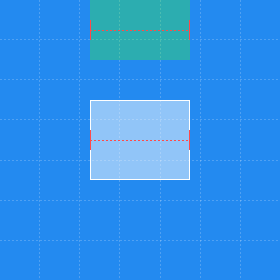
--


``` Swift
view.sizeHeightToHeight(of: itemView)
```
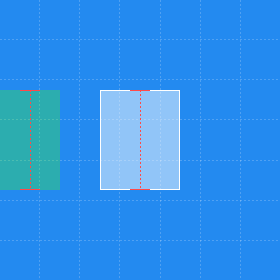
--


``` Swift
view.sizeHeightToWidth(of: itemView)
```
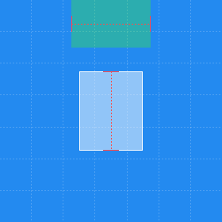
--


``` Swift
view.sizeWidthToHeight(of: itemView)
```
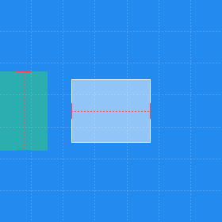
--


``` Swift
view.sizeWidthAndHeightToWidthAndHeight(of: itemView)
```
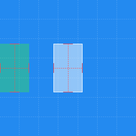
--


``` Swift
view.sizeHeightToWidth(withAspectRatio: 16/9)
```
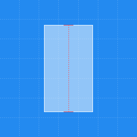
--


``` Swift
view.sizeWidthToHeight(withAspectRatio: 16/9)
```
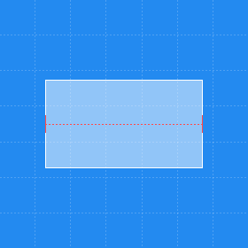
--

### Position

``` Swift
view.positionAbove(itemView, withOffset: 20)
```
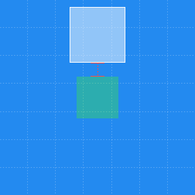
--


``` Swift
view.positionToTheRight(of: itemView, withOffset: 20)
```

--


``` Swift
view.positionBelow(itemView, withOffset: 20)
```
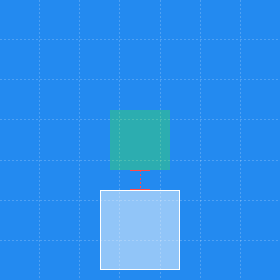
--


``` Swift
view.positionToTheLeft(of: itemView, withOffset: 20)
```
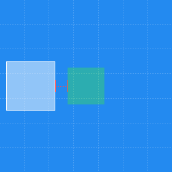
--


``` Swift
[view1, view2, view3].positionAbove(itemView, withOffset: 20)
```
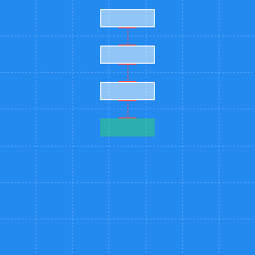
--


``` Swift
[view1, view2, view3].positionToTheRight(of: itemView, withOffset: 20)
```
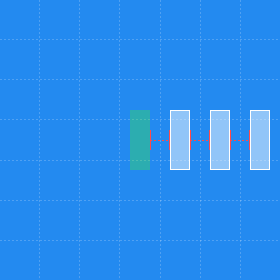
--


``` Swift
[view1, view2, view3].positionBelow(itemView, withOffset: 20)
```
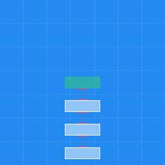
--


``` Swift
[view1, view2, view3].positionToTheLeft(of: itemView, withOffset: 20)
```
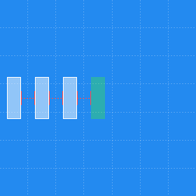
--

### Between

``` Swift
view.fitBetween(top: topView, andBottom: bottomView, withOffset: 20)
```
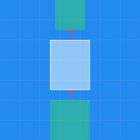
--


``` Swift
view.fitBetween(left: leftView, andRight: rightView, withOffset: 20)
```
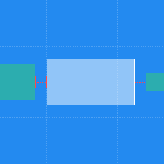
--

### Fill

``` Swift
parentView.fillHorizontally(withViews: [view1, view2, view3], separation: 20)
```

--


``` Swift
parentView.fillVertically(withViews: [view1, view2, view3], separation: 20)
```
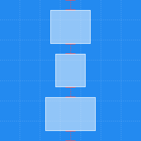
--

### Bound

``` Swift
itemView.boundHorizontally(withViews: [view1, view2, view3], separation: 20)
```
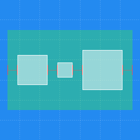
--


``` Swift
itemView.boundVertically(withViews: [view1, view2, view3], separation: 20)
```
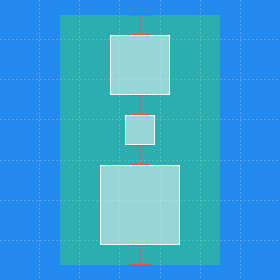
--


``` Swift
itemView.boundVertically(withViews: [view1, view2, view3], separation: 20)
```


## Progress:
- [X] Travis
- [X] Badges
- [X] Tests
- [X] Carthage
- [X] CocoaPods
- [X] Description
- [X] Documentation
- [X] Example App
- [X] AppleTV
- [X] Prebuilt Frameworks
- [ ] Travis Test Matrix
